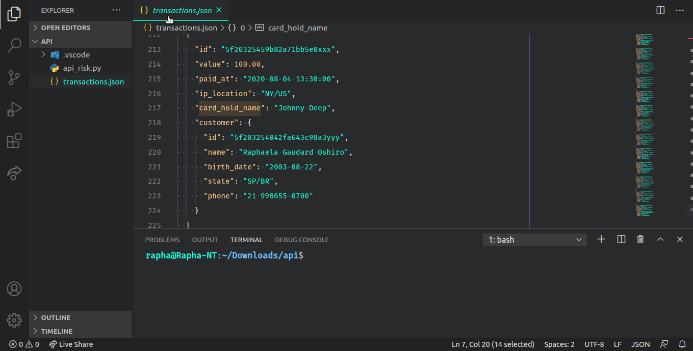

# API para análise de Risco de Fraude

## Conteudos
* [Info](#info)
* [Technologia](#technologia)
* [Método de avaliação](#Método-de-avaliação)
* [Run](#run)

## Info
O projeto é uma **api** que avalia uma transação de um e-commerce e devolve um *score* de 0 a 100 de risco, sendo 0 (sem indícios de fraude) e 100 (com máximo risco de fraude). 
A api tem um **endpoint** que recebe via **POST** e como resultado mostra o ID de transação, nome e o score de risco do cliente.

## Método de avaliação:

* Estado em que a pessoa reside X Estado em que o IP se localiza, 
* DDD do numero telefônico da pessoa X Estado em que a pessoa reside
* Nome da pessoa X Nome da pessoa no cartão de crédito (**Card name**)
* Usuário menor de 18 anos
	
## Technologia

* Python 3

	
## Run (Rodando a api)

Pre-requisitos para rodar a api:

- Python 3 + Gerenciador de pacotes PIP

- Módulo requests:

$ pip3 install requests

Para rodar a api:

python3 api_risk.py

## Demonstração:

